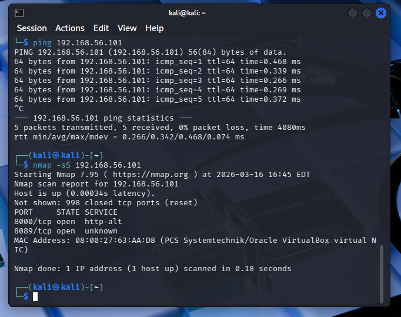
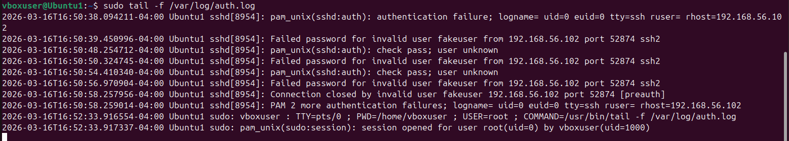

# SOC Analyst Home Lab

## Project Overview
This project demonstrates a basic SOC analyst home lab built using VirtualBox, Ubuntu, Kali Linux, and Splunk. The goal of the lab was to simulate suspicious authentication activity and detect it through SIEM log analysis.


## Objective
Build a hands-on security lab that demonstrates the ability to:
- Deploy a virtual lab environment
- Configure log collection in Splunk
- Simulate attacker activity from Kali Linux
- Detect failed SSH login attempts
- Investigate suspicious events using SIEM queries

## Lab Environment
- **Virtualization:** VirtualBox
- **Target VM:** Ubuntu
- **Attacker VM:** Kali Linux
- **SIEM:** Splunk Enterprise
- **Network Configuration:** NAT + Host-Only Adapter

## Network Architecture
- **Ubuntu VM**
  - NAT IP: `10.0.2.15`
  - Host-Only IP: `192.168.56.101`
- **Kali VM**
  - Host-Only network used to communicate with Ubuntu

## Project Steps
1. Created Ubuntu and Kali Linux virtual machines in VirtualBox
2. Configured NAT for internet access and Host-Only networking for VM-to-VM communication
3. Installed Splunk Enterprise on Ubuntu
4. Added `/var/log` data into Splunk using the `linux_secure` source type
5. Installed and enabled OpenSSH server on Ubuntu
6. Generated failed SSH login attempts from Kali Linux
7. Queried Splunk to detect failed authentication activity

## Attack Simulation
From Kali Linux, failed SSH login attempts were made against the Ubuntu VM using an invalid username.

Example command used:

```bash
ssh fakeuser@192.168.56.101

---

## Screenshots

### VMs shown up and running


### Splunk dashboard


### Initial Recon from Kali VM terminal


### Recon log from Splunk on Ubuntu1 VM


### Login Failure on Kali VM terminal $


### Login Failure on Ubuntu1 Terminal


### Login Failure on Ubuntu1 Splunk log


### Attacker Confirmation on Ubuntu Splunk

