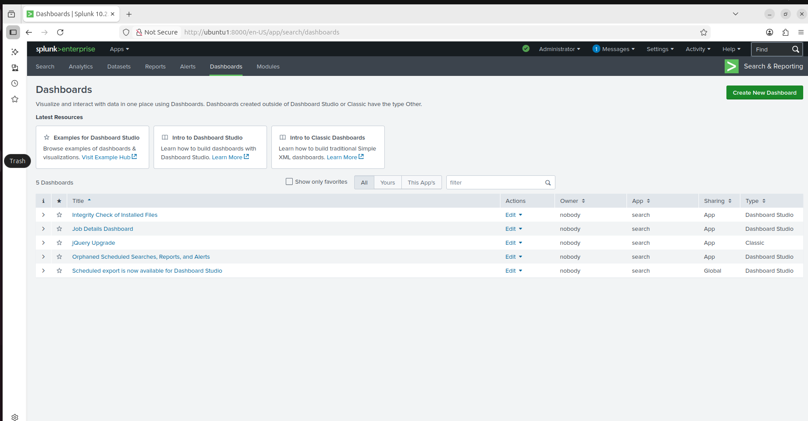
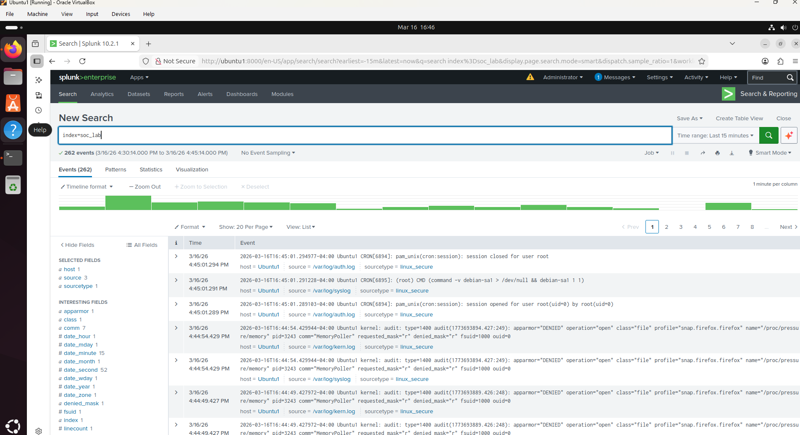
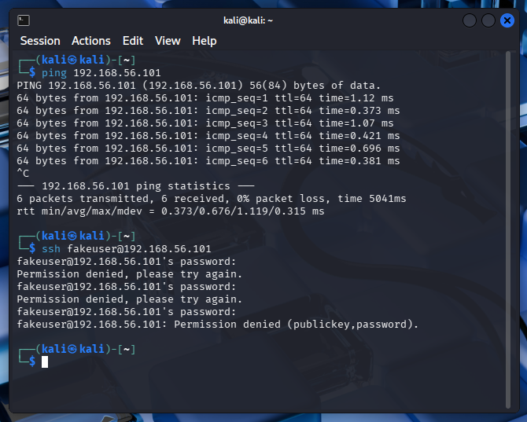
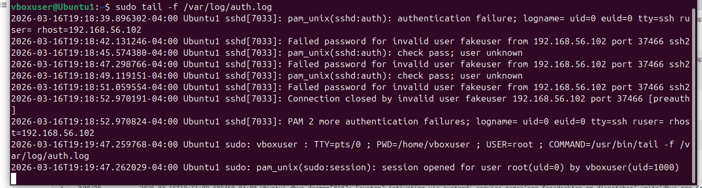
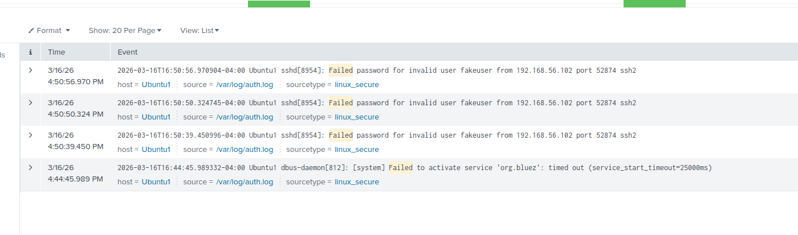
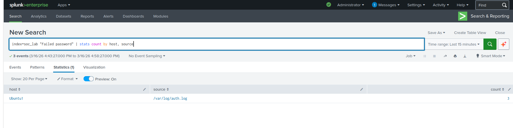

# SOC Analyst Home Lab - Splunk Detection Project

## Project Overview
This project demonstrates a basic SOC analyst home lab built using VirtualBox, Ubuntu, Kali Linux, and Splunk. The goal of the lab was to simulate suspicious authentication activity and detect it through SIEM log analysis.


## Lab Architecture

```
Kali Linux (Attacker)
        │
        │  SSH Attempts
        ▼
Ubuntu Server (Target + Log Source)
        │
        │  Log Forwarding
        ▼
Splunk SIEM (Detection & Analysis)
```

## Objective
Build a hands-on security lab that demonstrates the ability to:
- Deploy a virtual lab environment
- Configure log collection in Splunk
- Simulate attacker activity from Kali Linux
- Detect failed SSH login attempts
- Investigate suspicious events using SIEM queries

## Lab Environment
| Component | Technology |
|-----------|------------|
| Virtualization | VirtualBox |
| Attacker Machine | Kali Linux |
| Target Machine | Ubuntu Server |
| SIEM Platform | Splunk Enterprise |
| Network Configuration | NAT + Host-Only Adapter |

## Key Splunk Queries

Detect failed SSH login attempts:

```spl
index=soc_lab "Failed password"
```
Show failed login attempts:
```spl
index=soc_lab "Failed password"
| stats count by host, source
```
View logs in Splunk
```spl
index=soc_lab
```

## Network Architecture
- **Ubuntu VM**
  - NAT IP: `10.0.2.15`
  - Host-Only IP: `192.168.56.101`
- **Kali VM**
  - Host-Only network used to communicate with Ubuntu

## Project Steps
1. Created Ubuntu and Kali Linux virtual machines in VirtualBox
2. Configured NAT for internet access and Host-Only networking for VM-to-VM communication
3. Installed Splunk Enterprise on Ubuntu
4. Added `/var/log` data into Splunk using the `linux_secure` source type
5. Installed and enabled OpenSSH server on Ubuntu
6. Generated failed SSH login attempts from Kali Linux
7. Queried Splunk to detect failed authentication activity

## Attack Simulation
From Kali Linux, failed SSH login attempts were made against the Ubuntu VM using an invalid username.

Example command used:

```bash
ssh fakeuser@192.168.56.101
```

## Incident Summary

During testing, multiple failed SSH authentication attempts were generated from the Kali Linux attacker machine targeting the Ubuntu server.

These attempts were recorded in the Ubuntu authentication logs and successfully ingested into Splunk. Splunk searches were then used to identify and aggregate the failed login activity.

This demonstrates how SIEM platforms can be used to detect suspicious authentication behavior and support security investigations.

---

## Screenshots

### VMs shown up and running


### Splunk dashboard


### Initial Recon from Kali VM terminal


### Recon log from Splunk on Ubuntu1 VM


### Login Failure on Kali VM terminal


### Login Failure on Ubuntu1 Terminal


### Login Failure on Ubuntu1 Splunk log


### Attacker Confirmation on Ubuntu Splunk


## Future Improvements

- Integrate Suricata IDS for network-based detection
- Create Splunk dashboards for authentication monitoring
- Simulate additional attack techniques such as port scanning and brute-force attacks
- Expand the lab with additional monitored hosts
