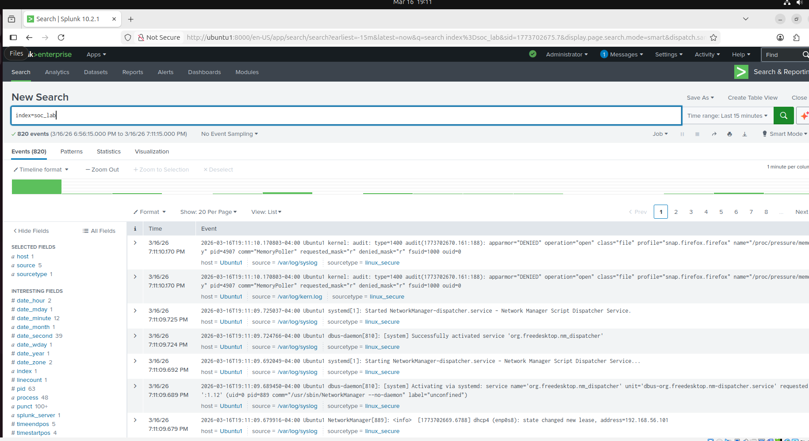
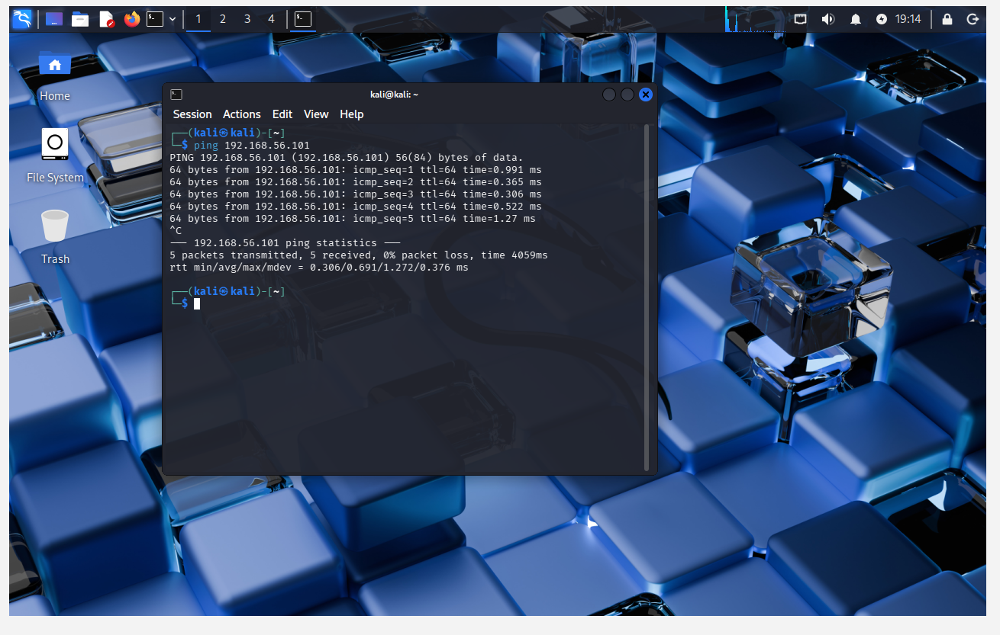
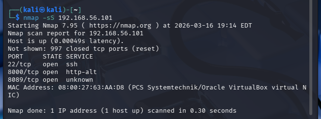
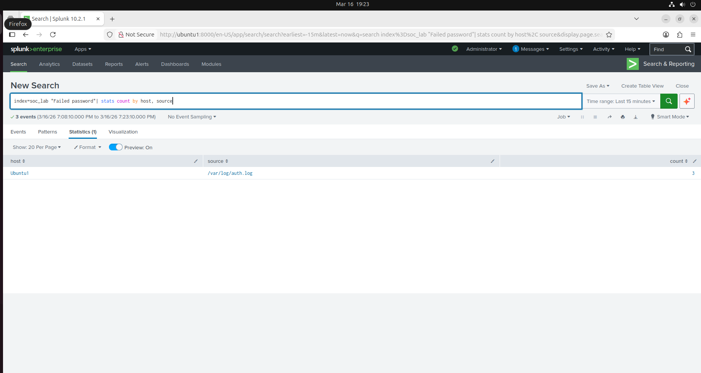

# SOC Analyst Home Lab - Splunk Detection Project

## Project Overview
This project demonstrates a SOC analyst home lab built using VirtualBox, Ubuntu, Kali Linux, and Splunk. The lab simulates suspicious authentication activity and demonstrates a simple SOC investigation workflow from reconnaissance to SIEM detection.

<p align="center">


</p>

## Lab Architecture

```
Kali Linux (Attacker)
        │
        │  SSH Attempts
        ▼
Ubuntu Server (Target + Log Source)
        │
        │  Log Forwarding
        ▼
Splunk SIEM (Detection & Analysis)
```

## Objective
Build a hands-on security lab that demonstrates the ability to:
- Deploy a virtual lab environment
- Configure log collection in Splunk
- Simulate attacker activity from Kali Linux
- Detect failed SSH login attempts
- Investigate suspicious events using SIEM queries

## Lab Environment
| Component | Technology |
|-----------|------------|
| Virtualization | VirtualBox |
| Attacker Machine | Kali Linux |
| Target Machine | Ubuntu Server |
| SIEM Platform | Splunk Enterprise |
| Network Configuration | NAT + Host-Only Adapter |

## Key Splunk Queries

Detect failed SSH login attempts:

```spl
index=soc_lab "Failed password"
```
Show failed login attempts:
```spl
index=soc_lab "Failed password"
| stats count by host, source
```
View logs in Splunk
```spl
index=soc_lab
```

## Network Architecture
- **Ubuntu VM**
  - NAT IP: `10.0.2.15`
  - Host-Only IP: `192.168.56.101`
- **Kali VM**
  - Host-Only network used to communicate with Ubuntu

## Project Steps
1. Created Ubuntu and Kali Linux virtual machines in VirtualBox
2. Configured NAT for internet access and Host-Only networking for VM-to-VM communication
3. Installed Splunk Enterprise on Ubuntu
4. Added `/var/log` data into Splunk using the `linux_secure` source type
5. Installed and enabled OpenSSH server on Ubuntu
6. Generated failed SSH login attempts from Kali Linux
7. Queried Splunk to detect failed authentication activity

## Attack Simulation
From Kali Linux, failed SSH login attempts were made against the Ubuntu VM using an invalid username.

Example command used:

```bash
ssh fakeuser@192.168.56.101
```

## Incident Summary

The authentication logs show repeated failed login attempts originating from the Kali Linux attacker machine (192.168.56.102) targeting the Ubuntu server (192.168.56.101).

These attempts were recorded in the Ubuntu authentication logs and successfully ingested into Splunk. Splunk searches were then used to identify and aggregate the failed login activity.

This demonstrates how SIEM platforms can be used to detect suspicious authentication behavior and support security investigations.

---

## SOC Investigation Walkthrough

### Splunk Enterprise Running


### Network Connectivity Test from Kali (Ping)


### Port Scan Reconnaissance Using Nmap


### SSH Authentication Attack from Kali


### Failed SSH Login Recorded on Ubuntu Server


### Failed SSH Login Detected in Splunk


## Future Improvements

- Integrate Suricata IDS for network-based detection
- Create Splunk dashboards for authentication monitoring
- Simulate additional attack techniques such as port scanning and brute-force attacks
- Expand the lab with additional monitored hosts
- Implement alerting rules in Splunk to automatically detect repeated failed authentication attempts

## Detection Rule

To identify suspicious authentication activity, a Splunk search query was created to detect repeated failed SSH login attempts recorded in the system authentication logs.

### Detection Logic
The rule searches for failed SSH authentication events within the indexed Ubuntu system logs.

Example detection query:

```spl
index=soc_lab "Failed password"
| stats count by host, source
```

### Detection Purpose
This query helps identify:

- Repeated authentication failures
- Potential brute-force login attempts
- Suspicious login behavior originating from attacker systems

### Investigation Outcome
Using this detection query, multiple failed login attempts from the Kali Linux attacker machine were successfully identified within Splunk. The events were traced back to the Ubuntu server authentication logs, confirming that the attack activity was properly logged and detected by the SIEM platform.
